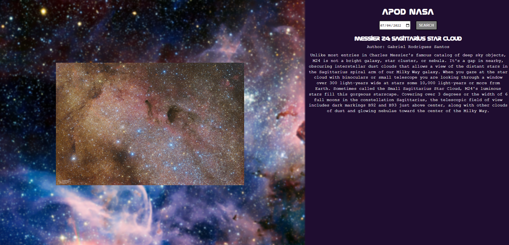
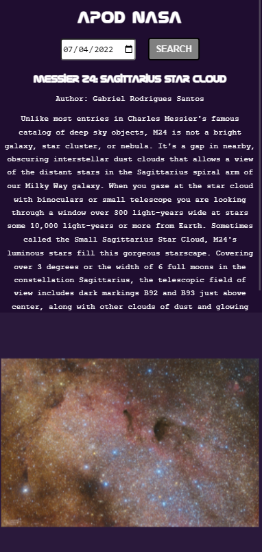

#  Projeto NASA Picture of the Day
O projeto consite em uma página simples que realizar a busca na API aberta da NASA, trazendo uma foto ou vídeo de acordo com o dia escolhido.

## Funcionamento
Para receber a foto do dia,nbasta selecionar a data no campo de input. Eventualmente a página pode demorar um pouco para repsonder  em horários de muitas requisições.

## Versão Desktop

## Versão Mobile

